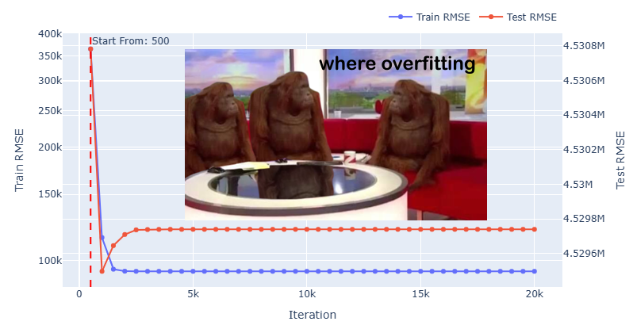
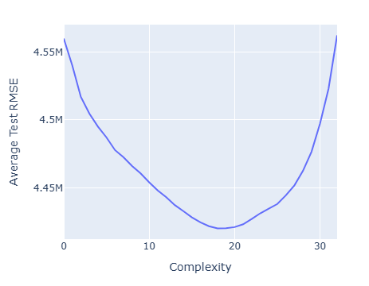
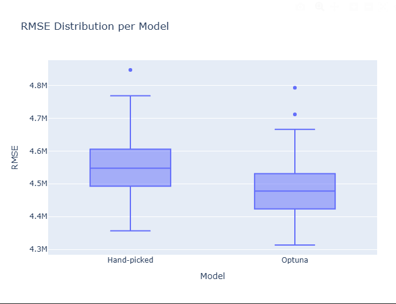
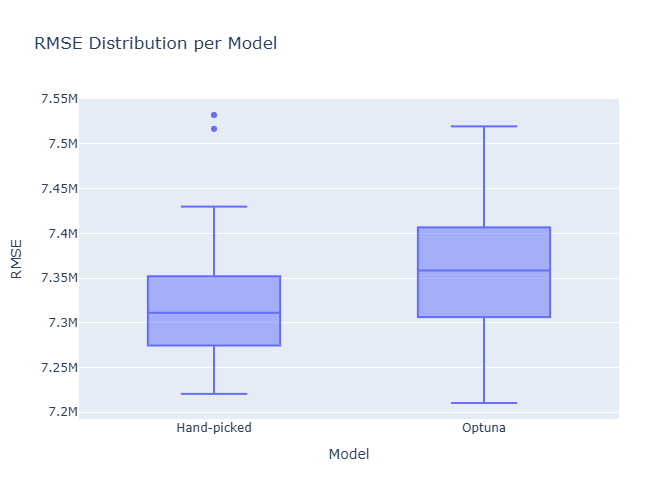
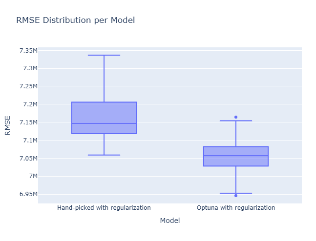

# Overfitting and Robustness Analysis with LightGBM

This is a project where I try to understand what is overfitting/robustness using LightGBM in regression task of predicting apartment prices.

## Project Structure

It consists of two parts:

### 1. Trying to recreate ubiquitous overfitting illustrations

Which itself consists of two parts:

#### 1.1. Recreating overtraining in single model training (number of train iterations)
[Overfitting notebook](notebooks/overfitting.ipynb)

This is mostly failed, because of LightGBM algorithm.

#### 1.2. Recreating overtraining in multiple models by observing model complexity/model accuracy
This mostly holds.

My overall impression: I am not impressed and don't understand what is all the fuss about. As far as I understand, if you have solid pipeline you have nothing to worry about, at least in context of LightGBM and similar algorithms.

### 2. Testing robustness/distribution shift

[Robustness notebook](notebooks/robustness.ipynb)

Here I try to check whether common wisdom (and even official guides) about LightGBM holds in context of model robustness. For this I test different models (conservative, "prone to overfitting") on a modified data with distribution shift.

#### 2.1 Hand-picked vs Optuna params on non shifted data

#### 2.2 Hand-picked vs Optuna params on shifted data

#### 2.3 Hand-picked vs Optuna params on shifted data (both with regularization)

And it mostly doesn't hold. More conservative parameters do perform better without regularization, but once regularization is introduced, the supposedly overfitting-prone parameters perform better. So the range of viable parameters is much broader than common wisdom suggests, and you should trust your CV/pipeline more.

## Tags
#overfitting #robustness #regression #lightgbm #optuna